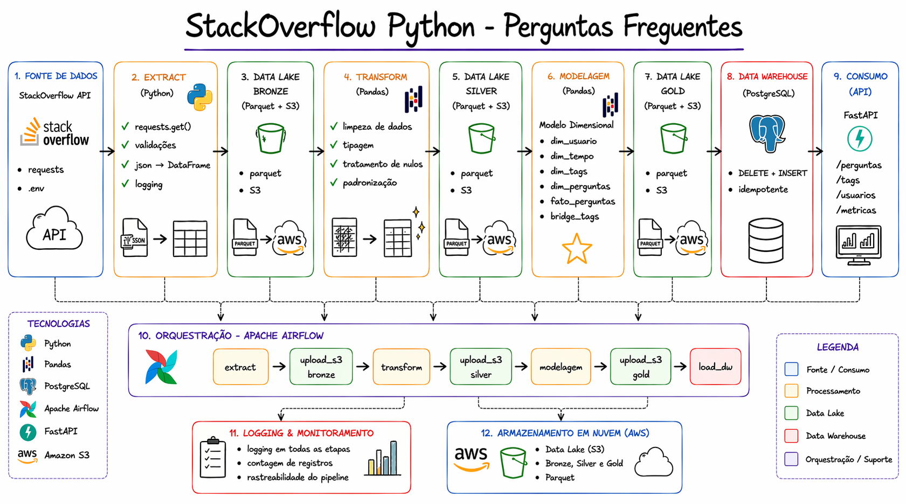

# 🐍 Python Stack Overflow — Analytics Pipeline

Pipeline ETL completo que coleta perguntas sobre Python do Stack Overflow, processa os dados em um data lake com arquitetura Medallion (Bronze/Silver/Gold), armazena em AWS S3, carrega um modelo estrela no PostgreSQL e expõe os dados via API REST — com orquestração via Apache Airflow e containerização com Docker.

---

## 🏗️ Arquitetura



```
Stack Overflow API
       ↓
  [ Bronze ]  →  dado bruto em Parquet + AWS S3
       ↓
  [ Silver ]  →  dado limpo e tratado em Parquet + AWS S3
       ↓
  [ Gold ]    →  star schema em Parquet + AWS S3 + PostgreSQL
       ↓
  [ FastAPI ] →  endpoints REST para consumo dos dados
       ↓
  [ Airflow ] →  orquestração de todo o pipeline via DAGs
```

---

## 🗂️ Estrutura do Projeto

```
├── app/
│   ├── db/
│   │   └── database.py             # Conexão com o banco
│   ├── routers/
│   │   ├── perguntas.py            # Rotas de perguntas
│   │   ├── tags.py                 # Rotas de tags
│   │   ├── usuarios.py             # Rotas de usuários
│   │   └── metricas.py             # Rotas de métricas
│   ├── dependencies.py             # Injeção de dependência (get_db)
│   └── main.py                     # Inicialização da API
├── src/
│   ├── bronze/
│   │   └── extract.py              # Extração da API, carga bronze e upload S3
│   ├── silver/
│   │   └── transform.py            # Transformação, carga silver e upload S3
│   ├── gold/
│   │   ├── build_metrics.py        # Modelagem dimensional, carga gold e upload S3
│   │   └── load.py                 # Carga no PostgreSQL (DELETE + INSERT idempotente)
│   ├── utils/
│   │   └── s3_loader.py            # Utilitário de upload para AWS S3
│   └── main.py                     # Orquestrador local do pipeline
├── dags/
│   └── run_pipeline.py             # DAG do Airflow com tasks e dependências
├── sql/
│   └── script_tabelas.sql          # DDL das tabelas no PostgreSQL
├── data_lake/
│   ├── bronze/                     # Parquet bruto
│   ├── silver/                     # Parquet tratado
│   └── gold/                       # Parquet modelado
├── docker-compose.yml              # Orquestração dos containers
├── Dockerfile                      # Imagem da API
├── Dockerfile.airflow              # Imagem do Airflow com dependências do projeto
├── .env.example                    # Exemplo de variáveis de ambiente
├── requirements.txt
└── Makefile
```

---

## 🗃️ Modelagem do Banco

Modelo estrela com bridge table para resolver a relação muitos-para-muitos entre perguntas e tags.

```
dim_usuario     → dados do usuário que fez a pergunta
dim_tempo       → data e hora da pergunta (ano, mês, dia, hora, dia da semana)
dim_tags        → tecnologias relacionadas à pergunta
dim_perguntas   → título e licença da pergunta
fato_perguntas  → métricas: visualizações, respostas, pontuação, respondida
bridge_tags     → relacionamento N:N entre perguntas e tags
```

---

## 🚀 Como Rodar o Projeto

### Opção 1 — Docker (recomendado)

#### Pré-requisitos

- Docker e Docker Compose instalados

#### 1. Clone o repositório

```bash
git clone https://github.com/matheus-dataeng/stackoverflow-analytics-pipeline
cd stackoverflow-analytics-pipeline
```

#### 2. Configure o `.env.docker`

```bash
cp .env.example .env.docker
```

Preencha com suas credenciais:

```dotenv
# URL da API
API_URL=https://api.stackexchange.com/2.3/questions/unanswered?order=desc&sort=activity&tagged=python&site=stackoverflow

# Banco de dados
POSTGRES_USER=postgres
POSTGRES_PASSWORD=sua_senha
POSTGRES_DB=stackoverflow_dw

DB_USER=postgres
DB_PASSWORD=sua_senha
DB_HOST=postgres
DB_PORT=5432
DB_NAME=stackoverflow_dw

# Tabelas
TABLE_DIM_USUARIOS=dim_usuario
TABLE_DIM_TEMPO=dim_tempo
TABLE_DIM_TAGS=dim_tags
TABLE_DIM_PERGUNTAS=dim_perguntas
TABLE_FATO_PERGUNTAS=fato_perguntas
TABLE_BRIDGE_TAGS=bridge_tags

# Airflow
AIRFLOW__CORE__EXECUTOR=LocalExecutor
AIRFLOW__CORE__FERNET_KEY=sua_fernet_key
AIRFLOW__CORE__LOAD_EXAMPLES=false
AIRFLOW__WEBSERVER__SECRET_KEY=sua_secret_key

# AWS S3
AWS_ACCESS_KEY_ID=sua_chave
AWS_SECRET_ACCESS_KEY=sua_chave_secreta
AWS_DEFAULT_REGION=us-east-1
BUCKET=nome_do_seu_bucket
```

#### 3. Suba os containers

```bash
docker-compose up --build
```

Isso sobe 4 containers: **PostgreSQL**, **Airflow Webserver**, **Airflow Scheduler** e **API**.

#### 4. Crie os bancos no PostgreSQL

Conecte via PgAdmin ou psql em `localhost:5435` e crie os bancos:

```sql
CREATE DATABASE airflow;
CREATE DATABASE stackoverflow_dw;
```

#### 5. Crie as tabelas

Execute o script no banco `stackoverflow_dw`:

```bash
psql -h localhost -p 5435 -U postgres -d stackoverflow_dw -f sql/script_tabelas.sql
```

#### 6. Execute o pipeline via Airflow

Acesse `http://localhost:8080` com as credenciais `admin / admin`, localize a DAG `Pipeline_StackOverFlow` e dispare manualmente.

#### 7. Acesse a API

```
http://localhost:8000/docs
```

---

### Opção 2 — Local (sem Docker)

#### Pré-requisitos

- Python 3.10+
- PostgreSQL instalado localmente

#### 1. Clone e configure o ambiente

```bash
git clone https://github.com/matheus-dataeng/stackoverflow-analytics-pipeline
cd stackoverflow-analytics-pipeline
python -m venv venv
source venv/bin/activate        # Linux/Mac
venv\Scripts\activate           # Windows
pip install -r requirements.txt
```

#### 2. Configure o `.env`

```bash
cp .env.example .env
```

Preencha com suas credenciais locais.

#### 3. Crie as tabelas no banco

```bash
psql -h localhost -U postgres -d stackoverflow_dw -f sql/script_tabelas.sql
```

#### 4. Rode o pipeline

```bash
python src/main.py
```

#### 5. Suba a API

```bash
uvicorn app.main:app --reload
```

---

## 🔌 Endpoints da API

### Perguntas
| Método | Rota | Descrição |
|--------|------|-----------|
| GET | `/perguntas` | Lista todas as perguntas |
| GET | `/perguntas/sem-resposta` | Perguntas sem nenhuma resposta |
| GET | `/perguntas/mais-vistas` | Perguntas ordenadas por visualizações |

### Tags
| Método | Rota | Descrição |
|--------|------|-----------|
| GET | `/tags` | Lista todas as tags |
| GET | `/tags/mais-frequentes` | Tags com mais perguntas associadas |

### Usuários
| Método | Rota | Descrição |
|--------|------|-----------|
| GET | `/usuarios` | Lista todos os usuários |
| GET | `/usuarios/mais-ativos` | Usuários com mais perguntas |

### Métricas
| Método | Rota | Descrição |
|--------|------|-----------|
| GET | `/metricas/por-ano` | Volume de perguntas por ano |
| GET | `/metricas/por-tag` | Contagem de perguntas agrupada por tag |

Documentação interativa disponível em `http://localhost:8000/docs`.

---

## 🛠️ Stack

| Tecnologia | Uso |
|---|---|
| **Python** | Linguagem principal |
| **Pandas** | Transformação e modelagem dos dados |
| **FastAPI** | API REST com documentação automática |
| **SQLAlchemy** | ORM e conexão com PostgreSQL |
| **PostgreSQL** | Data Warehouse relacional |
| **Apache Airflow** | Orquestração do pipeline via DAGs |
| **Docker / Docker Compose** | Containerização de todos os serviços |
| **AWS S3** | Armazenamento das camadas do data lake |
| **Parquet** | Formato de armazenamento em cada camada |
| **python-dotenv** | Gerenciamento de variáveis de ambiente |

---

## 🔮 Próximos Passos

- [ ] Cobertura de testes com **pytest** nas funções de transformação
- [ ] Deploy da API em **AWS** (RDS + API Gateway)
- [ ] Frontend para consumo e visualização dos dados

